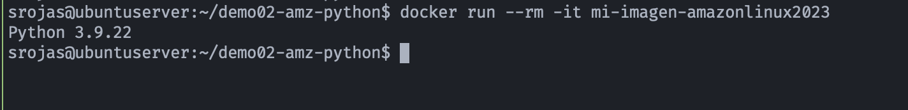

## 🛠️ Demo: Imagen de contenedor con Amazon Linux 2023 + Python


## 🎯 Objetivo (Target)
- Crear una imagen de contenedor con **Amazon Linux 2023**, usa un **Dockerfile** simple basado en la imagen oficial de Amazon Linux 2023 que ya está disponible en **Amazon ECR Public Gallery**
- Incluye la instalación de python.
- Usar este Dockerfile como base y adaptar los paquetes o configuraciones según lo que se necesite ejecutar en el contenedor (apps web, scripts, etc.).

---

## Pasos para contruir la imagen
### 1.- Crear Imagen: Ejecutar en el mismo directorio del archivo dockerfile
```bash
docker build -t mi-imagen-amazonlinux2023 .
```

### 2.- Correr contenedor
```bash
docker run --rm -it mi-imagen-amazonlinux2023
```

## 🚀 Resultado (Outcome)
### Ejecución de contendor
 <p align="center">
    
</p>

---

## 📚 Referencias
- [Amazon ECR Public Gallery](https://gallery.ecr.aws/amazonlinux/amazonlinux)
- [Amazon Linux 2023 FAQs](https://aws.amazon.com/linux/amazon-linux-2023/faqs/)

---